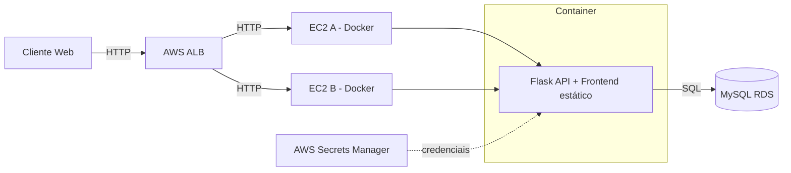
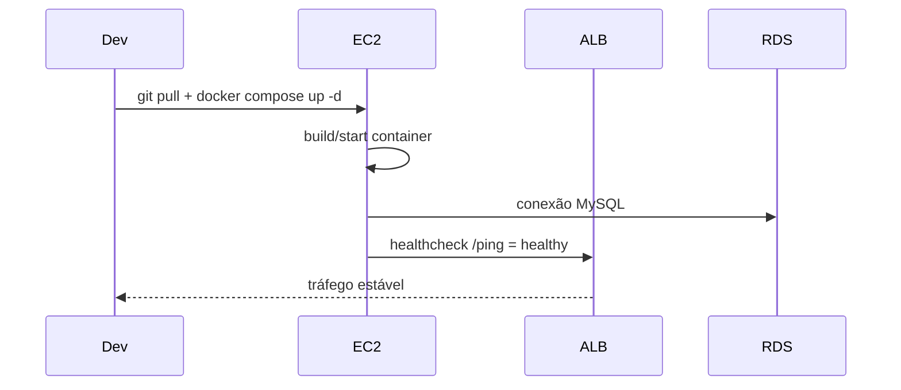
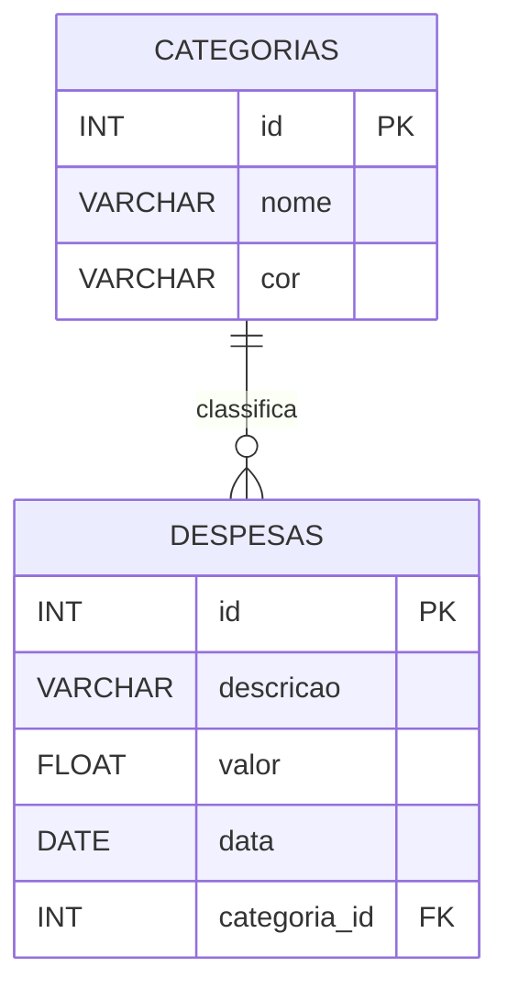

# CRUD Financeiro na AWS (Manual Setup via Console)

Este projeto consiste em uma aplicação web (backend + frontend) para controle financeiro, implantada manualmente na AWS, conforme escopo de onboarding DevOps/SRE.

---

## 📌 Escopo Atendido

- ✅ Infraestrutura criada manualmente via Console AWS
- ✅ Deploy do backend (Flask) e frontend (HTML/JS) com Docker em EC2
- ✅ Banco de dados MySQL no RDS
- ✅ ALB (Load Balancer) com Health Checks
- ✅ Alta disponibilidade com EC2 principal e reserva
- ✅ Testes realizados com sucesso

---

## 🧩 Estrutura da Infra

### VPC

- CIDR: `10.0.0.0/16`
- Subnets:
  - `subnet-public-a` (us-east-2a): `10.0.10.0/24`
  - `subnet-public-b` (us-east-2b): `10.0.20.0/24`
  - `subnet-private-a` (us-east-2a): `10.0.30.0/24`
  - `subnet-private-b` (us-east-2b): `10.0.40.0/24`

### Gateways

- Internet Gateway: Conectado à VPC
- NAT Gateway: Implantado em `subnet-public-a`, associado a um EIP

### Route Tables

- Rota pública: `0.0.0.0/0` -> IGW
- Rota privada: `0.0.0.0/0` -> NAT Gateway

---

## 💻 EC2

### Instâncias

- **EC2-A (principal)**
  - Nome: `crud-finance-ec2-a`
  - IP Público: `18.216.31.131`
  - Zona: `us-east-2a`
  - Rodando containers do backend e frontend
- **EC2-B (reserva)**
  - Nome: `crud-finance-ec2-b`
  - IP Público: `3.23.102.54`
  - Zona: `us-east-2b`
  - Configuração idêntica à EC2-A (docker-compose com .env)

### Docker

- Docker instalado via script manual
- Backend e frontend empacotados em um container
- `docker-compose.yml` usa `.env` com as variáveis do RDS

---

## 🐬 RDS (MySQL)

- Nome: `crud-finance-db-v2`
- Endpoint: `crud-finance-db-v2.couyq2fi02mr.us-east-2.rds.amazonaws.com`
- Porta: `3306`
- Público: `false` (acesso apenas via EC2)
- Banco: `crud_financeiro`
- Usuário: `admin`
- Senha: `*******` (armazenada no `.env`)

---

## ⚖️ Load Balancer

- ALB: `crud-finance-alb-233355946.us-east-2.elb.amazonaws.com`
- Listener: Porta 80 -> Target Group
- Target Group: EC2-A e EC2-B
  - Health Check: `/ping`
  - Intervalo: 5s
  - Timeout: 2s
  - Healthy threshold: 2

---

## 🔐 Security Groups

- **EC2 / ALB:**
  - Inbound: 80 (HTTP) de `0.0.0.0/0`
  - Inbound: 22 (SSH) de IP pessoal
- **RDS:**
  - Inbound: 3306 apenas das EC2 (via SG)

---

## 🚀 Deploy e Repositório

- Repositório GitHub: [crud-financeiro](https://github.com/prymax10/crud-financeiro)
- EC2-A fez push do código
- EC2-B fez `git clone` e usou `.env` com mesmo RDS

---

## ✅ Testes Realizados

- `/ping`: 200 OK via ALB
- `/api/categorias`: carregou com sucesso
- `/api/despesas`: integração com RDS
- Toda interface web funcionando
- ALB alternando entre instâncias (testado parando EC2-A, pós EC2-B.)
- Erros 500 diagnosticados e resolvidos

---

## 🧠 Observações

- `init_db.sql` utilizado para inicialização do banco
- `init_db.py` foi ajustado para não recriar o banco, apenas as tabelas
- `.env` com as credenciais precisa ser criado nas duas EC2

---

## Visão Geral

### Explicação não técnica
- **Problema que resolve**: organizar gastos do dia a dia, com categorias e estatísticas simples, acessível via web e pronto para rodar na nuvem.
- **Público-alvo**: pequenas equipes/projetos, freelancers e squads que precisam de um controle financeiro objetivo e de fácil operação.
- **Benefícios**:
  - Visualização rápida das despesas e totais por período.
  - Categorias pré-definidas para começar em minutos.
  - Implantação simples com Docker; escala horizontal via Load Balancer.

### Explicação técnica
- **Arquitetura**: Frontend estático (HTML/JS) + API Flask (Python) servidos no mesmo container Docker. Banco MySQL externo (RDS em produção). Balanceamento via ALB apontando para 2 EC2.
- **Tecnologias**: Flask, SQLAlchemy, MySQL, Docker, docker-compose; em produção: ALB, EC2, RDS e Secrets Manager.
- **Limites**:
  - Sem autenticação/controle de acesso nativo (pode ser adicionado).
  - Sem sistema de migrations (criação de schema via `create_all`).
  - Sem métricas/apm embutidos (usar CloudWatch/Prometheus externamente).

### Quando usar / Quando não usar
- **Quando usar**:
  - Precisa de CRUD financeiro leve e rápido de subir.
  - Time pequeno, baixo tráfego, foco em simplicidade.
  - Ambiente Docker/Compose ou EC2 com ALB.
- **Quando não usar**:
  - Requisitos de auditoria complexa e trilhas de aprovação.
  - Necessidade de multi-tenant, RBAC e relatórios avançados.
  - Escala massiva/latências ultra baixas sem ajustes adicionais.

### Ilustração


---

## Estrutura do Repositório (Repo Map)

```
crud-financeiro/
├─ app/
│  ├─ models/
│  └─ routes/
├─ static/
│  ├─ css/
│  └─ js/
├─ templates/
├─ app.py
├─ Dockerfile
├─ docker-compose.yml
├─ requirements.txt
├─ entrypoint.sh
├─ init_db.py
├─ init_db.sql
├─ insert_sample_data.py
└─ README.md
```

- `app/models`: modelos SQLAlchemy (`Categoria`, `Despesa`); dependem de `database.py`; impacto direto no schema e na API.
- `app/routes`: blueprints Flask (despesas, categorias, estatísticas); dependem dos modelos; definem contratos da API.
- `static` e `templates`: frontend estático e views; dependem da API em `/api`; impacto na UX.
- `app.py`: bootstrap Flask, registra rotas, healthcheck `/ping`; depende de `init_db` e envs de DB.
- `Dockerfile`/`docker-compose.yml`: empacotamento/execução; dependem de `requirements.txt` e variáveis de ambiente.
- `requirements.txt`: bibliotecas Python; impacta build e compatibilidade.
- `init_db.py`/`init_db.sql`/`insert_sample_data.py`: inicialização e seed do banco; dependem das credenciais e conectividade MySQL.

### Rota de leitura (onboarding rápido)
1) `README.md` (esta página)
2) `app.py` → `app/models/database.py` → `app/routes/*`
3) `docker-compose.yml` e `Dockerfile`
4) `static/js/api-url-config.js` e `templates/index.html`
5) `init_db.sql` e `insert_sample_data.py`

---

## Arquitetura

### Diagrama (alto nível)


### Fluxo de dados fim-a-fim
1) Requisição HTTP chega ao ALB → roteada para uma EC2 saudável.
2) Container executa Flask que recebe a rota `/api/*`.
3) API valida/parsa input, consulta/grava no MySQL via SQLAlchemy.
4) Resposta JSON é retornada ao cliente; frontend consome via `fetch`.

### Decisões e trade-offs
- Simplicidade (API + frontend no mesmo container) vs. acoplamento.
- `create_all()` na inicialização (rápido) vs. ausência de migrations formais.
- ALB + 2 EC2 (HA básica) vs. custos/complexidade de autoscaling.
- Secrets em Secrets Manager (seguro) vs. leitura em runtime (falhas de IAM).

### Componentes e pontos de falha

| Componente | Responsabilidade | Falhas comuns |
|---|---|---|
| ALB | Balancear tráfego | Healthcheck incorreto, target fora do ar |
| EC2/Container | Servir app | Falha de build, envs ausentes, porta bloqueada |
| Flask API | Regras de negócio | Exceções não tratadas, input inválido |
| MySQL RDS | Persistência | Credenciais/SG, schema divergente, índices ausentes |
| Secrets Manager | Segredos | IAM sem permissão, nome do segredo incorreto |

---

## Como rodar localmente

### Pré-requisitos
- Python 3.10+
- MySQL 8.x (local ou container)
- Docker e Docker Compose (opcional, para rodar via containers)

### Variáveis de ambiente

| Nome | Descrição | Exemplo | Obrigatório |
|---|---|---|---|
| DB_USER | Usuário do MySQL | `root` | Sim |
| DB_PASSWORD | Senha do MySQL | `senha123` | Sim |
| DB_HOST | Host do MySQL | `localhost` | Sim |
| DB_PORT | Porta do MySQL | `3306` | Não (3306) |
| DB_NAME | Nome do banco | `primosfincntrl` | Sim |
| FLASK_ENV | Ambiente | `development` | Não (`production`) |
| FLASK_APP | Entry da app | `app.py` | Não |

### Passos (venv)
```bash
cd crud-financeiro
python3 -m venv .venv && source .venv/bin/activate
pip install --upgrade pip
pip install -r requirements.txt

# Suba um MySQL local e crie o DB
mysql -h localhost -u root -p -e "CREATE DATABASE IF NOT EXISTS primosfincntrl;"

export DB_USER=root
export DB_PASSWORD=<sua_senha>
export DB_HOST=localhost
export DB_PORT=3306
export DB_NAME=primosfincntrl

# Inicializa tabelas e categorias padrão
python init_db.py

# Executa a aplicação
python app.py
# Acesse http://localhost:5000
```

### Alternativa (Docker Compose)
```bash
cd crud-financeiro
docker compose build
docker compose up -d
docker compose logs -f app
```

### Seed de dados
```bash
python insert_sample_data.py  # requer DB acessível e envs definidos
```

### Checklist de verificação
```bash
curl -i http://localhost:5000/ping          # Deve responder 200
ss -lntp | grep 5000                        # Porta em escuta
docker ps                                   # Container (se usando Compose)
```

---

## Build & Execução

### Build
```bash
docker build -t crud-financeiro:local .
```

### Subir/Derrubar serviços (Compose)
```bash
docker compose up -d      # iniciar
docker compose down       # derrubar
docker compose ps         # status
docker compose logs -f    # logs
```

### Testes e lint
- Não há suíte de testes neste repositório ainda.
- Lint opcional (se tiver flake8 instalado):
```bash
flake8 app
```

### Limpar artefatos
```bash
find . -type d -name __pycache__ -exec rm -rf {} +
docker image prune -f && docker builder prune -f
```

---

## Configuração & Ambientes

### Matriz de ambientes
- **dev**: MySQL local/container, `.env` ou variáveis exportadas.
- **stage**: EC2 única, segredos via Secrets Manager (recomendado), ALB opcional.
- **prod**: 2x EC2 atrás de ALB, RDS, segredos no Secrets Manager.

### Segredos e gestão
- Local: arquivo `.env` (não commitar) ou variáveis de ambiente.
- Produção: AWS Secrets Manager (nomes padronizados), acesso via IAM da instância.

### Parâmetros por ambiente (recomendado)
- `DB_USER`, `DB_PASSWORD`, `DB_HOST`, `DB_PORT`, `DB_NAME`.
- Healthcheck: `/ping` (ALB Target Group).

### Valores padrão
- `DB_PORT=3306`, `DB_NAME=primosfincntrl`, `FLASK_APP=app.py`.

### Armadilhas comuns
- Porta 5000 bloqueada no SG / firewall local.
- Credenciais inválidas do MySQL (usuário/host/privs).
- Variáveis de ambiente não exportadas no serviço.
- Nome/ARN de segredo incorreto (produção).

### Mini-FAQ
- “Posso usar SQLite?” → Não suportado neste repo; use MySQL.
- “Preciso do ALB em dev?” → Não; use `localhost:5000`.
- “Onde coloco as senhas?” → Local: `.env`/env vars; Prod: Secrets Manager.

---

## Deploy & Rollback

### Pipeline (alto nível)
1) Build Docker → 2) Provisionar/validar infraestrutura → 3) Deploy (Compose/Ansible) → 4) Healthcheck/ALB saudável → 5) Observabilidade.

### Pré-checks
- `curl http://<host>:5000/ping` deve responder 200.
- Conectividade MySQL OK.
- Schema atualizado (tabelas existem; categorias criadas).

### Passos (deploy manual em EC2)
```bash
ssh ubuntu@<ec2-ip>
cd /opt/crud-financeiro
git pull --rebase
docker compose build
docker compose up -d
curl -i http://localhost:5000/ping
```

### Critérios de sucesso
- Target do ALB “healthy”; rota `/ping` 200.
- Logs sem erros 5xx recorrentes.

### Rollback imediato
```bash
# Voltar commit anterior
git checkout HEAD~1
docker compose build && docker compose up -d

# ou (se usar tags de imagem)
docker compose pull && docker compose up -d
```

### Sequência (Mermaid)


---

## Banco de Dados

### Modelo ER


### Migrations
- Não há Alembic; o schema é criado via `db.create_all()` em `init_db`.
- Alterações de schema devem ser coordenadas e versionadas via commit/README.

### Aplicar/Reverter
- Aplicar: executar a app com credenciais válidas ou rodar `python init_db.py`.
- Reverter: executar scripts SQL manuais; efetuar backup antes.

### Seed
```bash
python insert_sample_data.py
```

### Integridade e índices
- Chave estrangeira `despesas.categoria_id → categorias.id`.
- Índices recomendados: `despesas.data`, `despesas.categoria_id`.
- Garantir `valor` negativo para despesas (tratado na camada de modelo).

### Queries úteis (diagnóstico)
```sql
SELECT COUNT(*) FROM despesas;
SELECT DATE_FORMAT(data, '%Y-%m') ym, SUM(valor) FROM despesas GROUP BY ym;
SELECT c.nome, SUM(d.valor) FROM despesas d JOIN categorias c ON c.id=d.categoria_id GROUP BY c.id ORDER BY SUM(d.valor) ASC;
```

---

## Operação & Observabilidade

### Logs
- Local: stdout da aplicação; use `docker compose logs -f`.
- Níveis: INFO por padrão (ver `database.py`).

### Métricas e alarmes
- Healthcheck `/ping` para ALB.
- Sugestão: CloudWatch Alarms (5xx, latência ALB, CPU EC2, conexões RDS).

### SLOs sugeridos
- Disponibilidade ≥ 99.5% / mês.
- Latência p95 de resposta da API ≤ 300 ms (rotas simples).

### Endpoints de saúde
- Liveness: `/ping`
- Readiness: `/ping` (com dependência de DB já inicializado)

### Troubleshooting (10 comuns)
1) 502 no ALB → App down. `docker compose ps` → `docker compose logs`. Corrija env/porta.
2) 500 na API → Exceção Python. `docker compose logs -f app`. Corrija stack trace.
3) Timeout no DB → SG/host/credenciais. `mysql -h <host> -u <user> -p`.
4) 404 inesperado → Rota errada. Ver `app/routes/*` e prefixos `/api`.
5) CORS no browser → Ver `Flask-CORS` e origem. Ajustar config.
6) Dados não aparecem → Filtro `periodo` aplicado. Tente sem `periodo`.
7) Despesa positiva → Modelo força negativo. Envie valor positivo; será armazenado negativo.
8) Build falha → Dependências do MySQL client. Rebuild com cache limpo.
9) Porta 5000 ocupada → `ss -lntp | grep 5000` e matar processo/alterar porta.
10) Segredo não lido (prod) → IAM/ARN do segredo. Validar permissões.

---

## Referência de API

- Base URL (local): `http://localhost:5000`
- Base URL (prod via ALB): `http://<alb-dns>`
- Prefixo: `/api`
- Auth: não requer (atual)

### Endpoints

| Método | Rota | Descrição | Auth |
|---|---|---|---|
| GET | `/ping` | Healthcheck | — |
| GET | `/api/categorias/` | Lista categorias | — |
| GET | `/api/categorias/{id}` | Obtém categoria | — |
| GET | `/api/despesas/` | Lista despesas (`periodo` opcional) | — |
| GET | `/api/despesas/{id}` | Obtém despesa | — |
| POST | `/api/despesas/` | Cria despesa | — |
| PUT | `/api/despesas/{id}` | Atualiza despesa | — |
| DELETE | `/api/despesas/{id}` | Exclui despesa | — |
| GET | `/api/estatisticas/total` | Total por período | — |
| GET | `/api/estatisticas/por-categoria` | Por categoria | — |

Parâmetro `periodo`: `diario`, `semanal`, `mensal`, `anual`.

### Contratos
```json
{ "descricao": "Conta de luz", "valor": 250.75, "data": "2025-10-10", "categoria_id": 1 }
```
```json
{ "id": 42, "descricao": "Conta de luz", "valor": -250.75, "data": "10/10/2025", "categoria_id": 1, "categoria_nome": "Moradia" }
```

### Exemplos
```bash
curl -i http://localhost:5000/ping
curl -s http://localhost:5000/api/categorias/ | jq
curl -s "http://localhost:5000/api/despesas/?periodo=mensal" | jq
```

### Erros
- 400: requisição inválida; 404: não encontrado; 500: erro interno.
Formato: `{ "error": "<mensagem>" }`

### Versionamento
- Versão atual v1 (implícita). Recomenda-se `/api/v1` em evoluções que quebrem compatibilidade.
